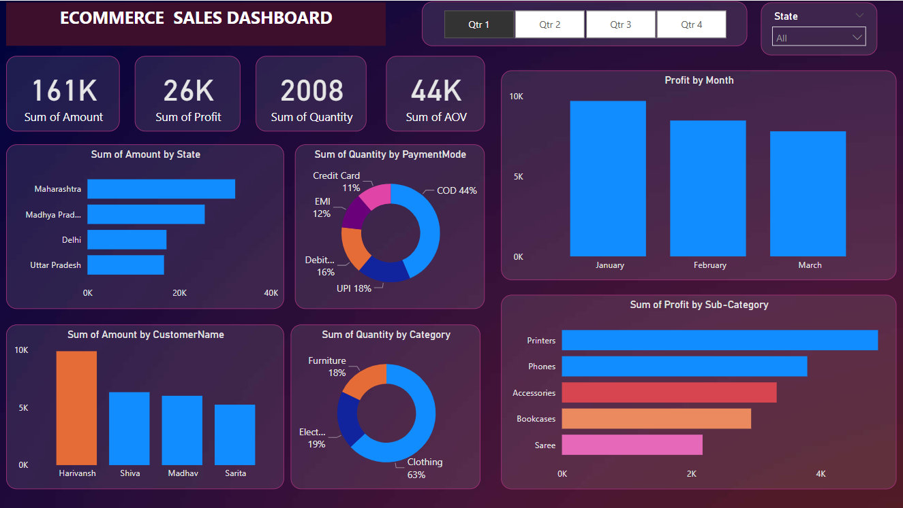

# 📊 eCommerce Sales Dashboard

## 🔍 Project Overview

This project showcases an interactive **Power BI dashboard** designed to track and analyze the sales performance of an eCommerce platform. Leveraging CSV files as the primary data source, the dashboard delivers key insights into **sales trends, profits, product performance**, and **customer behavior**—all in a visually compelling and intuitive format.

---

## 🚀 Key Features

- ✅ **Dynamic Dashboard**: Designed and developed a fully interactive dashboard using Power BI for real-time analysis of online sales.
- 🎛️ **Advanced Filters & Slicers**: Enabled deep-dive analysis by applying filters and slicers for time period, product category, region, and payment mode.
- 🔗 **Data Modeling**: Created relationships and performed table joins to combine multiple data sources and enable cross-functional reporting.
- 📐 **Calculated Metrics**: Implemented DAX calculations to derive critical business metrics including:
  - **Total Sales**
  - **Total Profit**
  - **Total Quantity Sold**
  - **Average Order Value (AOV)**

---

## 📈 Visualizations & Insights

- 📊 **KPI Cards**: Tracked **Sales**, **Profit**, **Quantity**, and **AOV** per quarter using KPI Index Cards for a quick overview of performance.
- 🌍 **Top States Bar Chart**: Identified and visualized the **top-performing states** with the highest sales each quarter.
- 🥧 **Product Distribution Pie Chart**: Analyzed the **sales contribution of individual products**.
- 💳 **Payment Mode Pie Chart**: Displayed the **distribution of transactions across various payment modes**.

---

## 📁 Data Source

- Format: CSV (.csv)
- Data includes: 
  - Product Details
  - Order Information
  - Customer Location
  - Payment Mode
  - Sales & Profit Figures

---

## 📌 Tools Used

| Tool          | Purpose                           |
|---------------|-----------------------------------|
| Power BI      | Dashboard design & data modeling  |
| DAX           | Data transformation & calculations|
| Microsoft Excel | Initial data cleanup (if needed) |

---

## 🧠 Business Value

This dashboard empowers eCommerce business stakeholders to:

- Monitor real-time sales performance.
- Identify top-selling products and regions.
- Understand customer purchase behavior.
- Make data-driven decisions to improve sales and profitability.

---

## 🖼️ Dashboard Preview

> Dashboard
  

---

## 📬 Contact

For feedback or queries, feel free to connect:

**Ehtesham**  
📧 [ehtquamar@gmail.com]  
📍 India  

---

⭐ *If you found this project insightful, don't forget to star this repository!*
